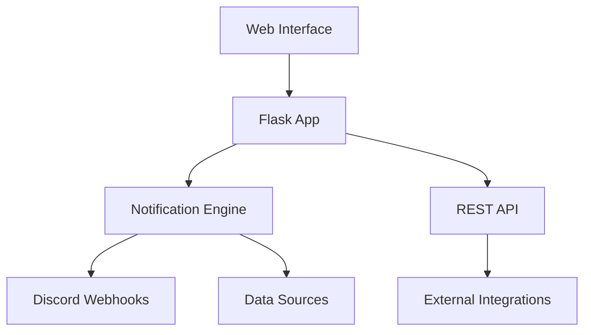

# 🚀 Turtifications Documentation
{: .fs-9 }

A powerful Discord notification system built with Flask that monitors APIs, detects changes, and sends rich notifications with embeds.
{: .fs-6 .fw-300 }

[Get started now](getting-started){: .btn .btn-primary .fs-5 .mb-4 .mb-md-0 .mr-2 }
[View on GitHub](https://github.com/yourusername/turtifications){: .btn .fs-5 .mb-4 .mb-md-0 }

---

## Features

✨ **Multiple Triggers**
: Timer-based, change detection, and webhook triggers

🎨 **Rich Discord Notifications**
: Message templates with variable substitution and Discord embeds

📋 **Flow Templates**
: Pre-built templates for Sonarr, Radarr, Kapowarr, and more

👀 **Real-time Preview**
: Preview notifications with real API data

📊 **Statistics & Monitoring**
: Track usage, success rates, and activity history

🔌 **REST API**
: Full API for external integrations

💾 **Import/Export**
: Backup and restore flow configurations

---

## Quick Navigation

### Getting Started
- [Installation & Setup](getting-started) - Get up and running quickly
- [Configuration](configuration) - Configure your Discord webhooks and settings

### Guides
- [Creating Notification Flows](guides/notification-flows) - Learn how to create custom notification flows
- [Using Templates](guides/templates) - Work with pre-built flow templates
- [API Usage](guides/api) - Integrate with the REST API

### Reference
- [API Documentation](api/reference) - Complete API reference
- [Template Variables](reference/variables) - Available template variables
- [Troubleshooting](troubleshooting) - Common issues and solutions

---

## Architecture Overview

Turtifications is built with a modular architecture:

### Core Components

**Flask Web Application**
: Provides the web interface for managing flows and configuration

**Notification Engine**
: Handles monitoring, change detection, and notification delivery

**REST API**
: Enables programmatic access and external integrations

**Discord Integration**
: Rich embed support with customizable formatting

---

## Community

- 🐛 [Report a bug](https://github.com/yourusername/turtifications/issues)
- 💡 [Request a feature](https://github.com/yourusername/turtifications/issues)
- 💬 [Join discussions](https://github.com/yourusername/turtifications/discussions)

---

## License

Turtifications is distributed under the [MIT License](https://github.com/yourusername/turtifications/blob/main/LICENSE).